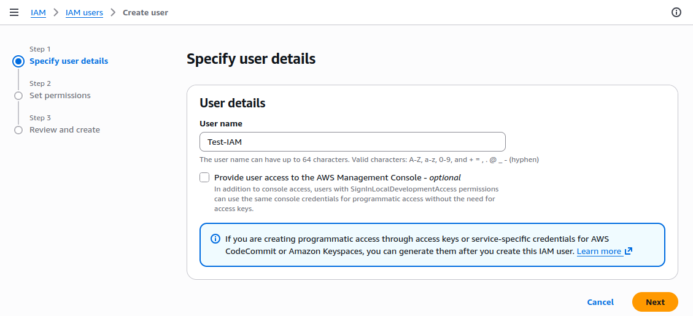
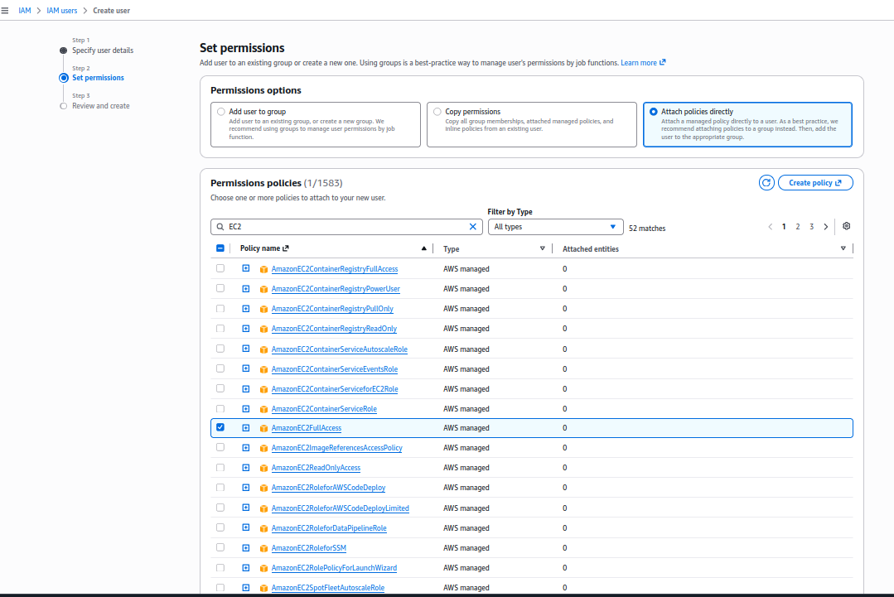
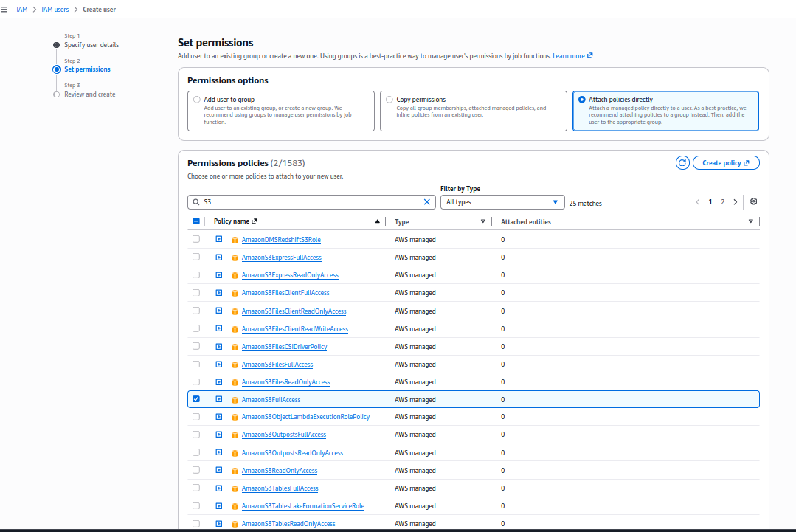
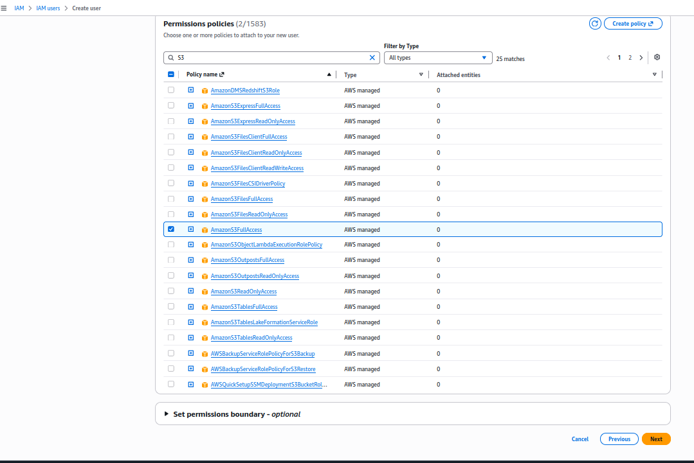
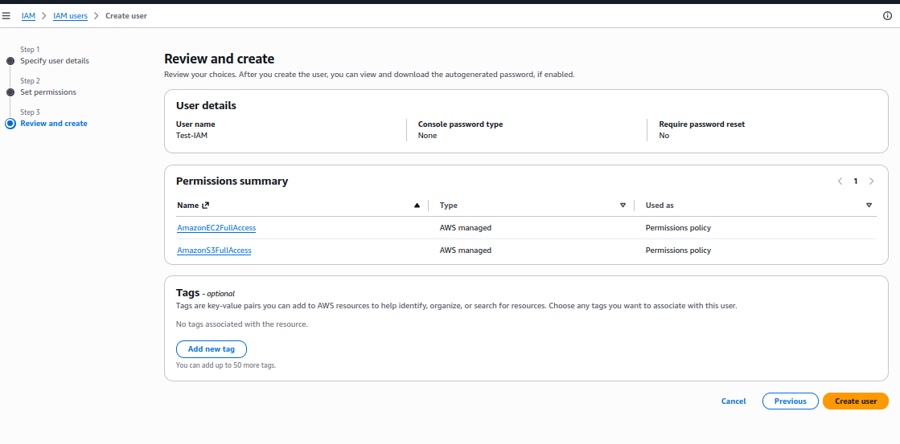
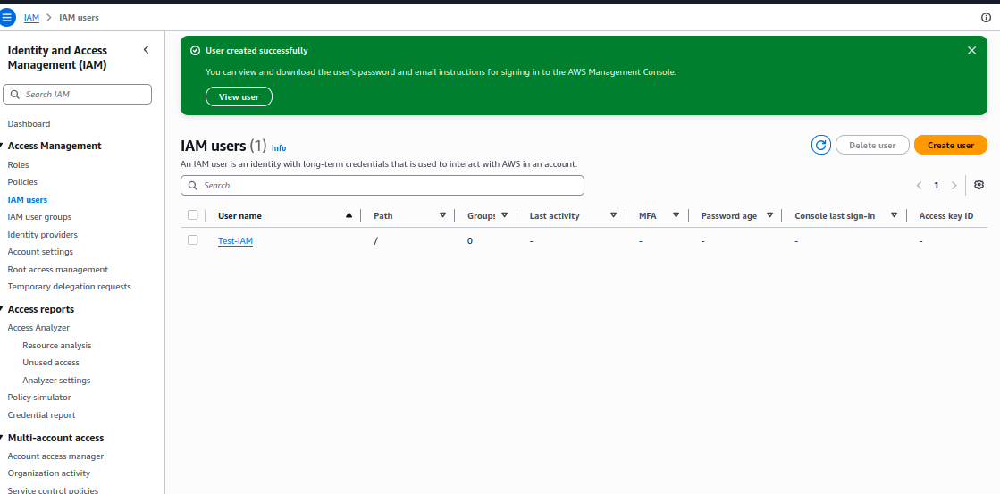
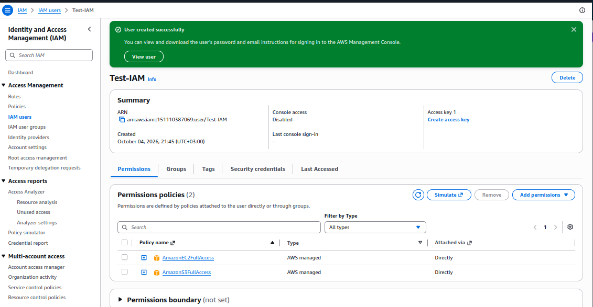
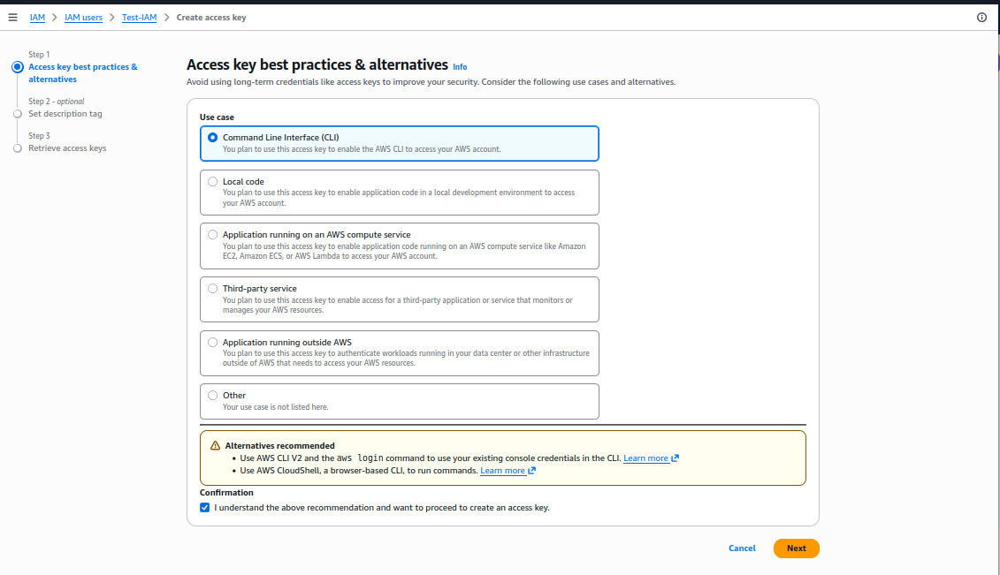
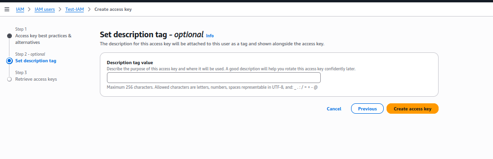
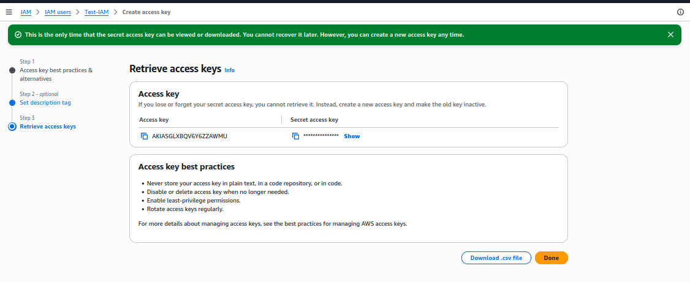

Для работы с AWS CLI сначала потребуется создать ключи.

* Набираем в поиске Амазона `IAM` и переходим на `IAM Dashboard`
* Ищем слева в меню `Access Management` -> `IAM users`
* Жмём `Create user`

---

* Шаг 1



---

* Шаг 2

Здесь каждому пользователю можно назначить любые права.  
Мы выбираем все права для `EC2`



---

* Шаг 3

И все права для управления `S3`



---

* Шаг 4

И затем жмём `Next`



---

* Шаг 5

Проверяем, что получилось именно так и жмём `Create user`



---

* Шаг 6

Создался пользователь, но пока без ключей. 
Кликаем по этому пользователю в таблице,



---

* Шаг 7

и на открывшейся странице выбираем `Create access key`



---

* Шаг 8

Выбираем первый (`CLI`) и последний (`понимаю, что делаю`) пункты.  
И жмём `Next`.



---

* Шаг 9

При желании, перед нажатием `Create access key` можно добавить комментарии



---

* Шаг 10

Перед закрытием не забудьте скачать ключи!   
Они показываются **только здесь** и **только один раз**!



---

* Шаг 11

**Запускаем настройку AWS CLI**:

```bash
aws configure
AWS Access Key ID [****************AWMU]: 
AWS Secret Access Key [****************h2Tf]: 
Default region name [eu-central-1]: 
Default output format [text]: 
```

После этого, в домашней директории радом c `.ssh` должна создаться директория `.aws`

```bash
ls -la ~/

drwxrwxr-x  2 su   su        4096 окт  4 22:18 .aws
-rw-------  1 su   su       55158 окт  4 20:40 .bash_history
-rw-r--r--  1 su   su         220 ное 26  2023 .bash_logout
-rw-r--r--  1 su   su        4018 авг 30 21:19 .bashrc
drwxrwxr-x 39 su   su        4096 авг 29 22:04 .cache
drwx------  2 su   su        4096 авг 29 22:07 .cagent
drwx------ 40 su   su        4096 окт  4 22:16 .config
-rw-rw-r--  1 su   su          54 май 16  2024 .gitconfig
drwx------  3 su   su        4096 мар  6  2024 .gnome
drwxrwxr-x  5 su   su        4096 май 13  2025 .npm
drwx------  2 su   su        4096 окт  4 17:44 .ssh
```

```bash
ls -la ~/.aws

su@su-HP-ProBook-470-G4:~$ ls -la ~/.aws
total 16
drwxrwxr-x  2 su su 4096 окт  4 22:18 .
drwxr-xr-x 48 su su 4096 окт  4 22:18 ..
-rw-------  1 su su   46 окт  4 22:18 config
-rw-------  1 su su  137 окт  4 22:18 credentials
```

---

* Шаг 12

**Как убедиться, что всё настроено правильно?**

**Важно**: в `EC2` должны быть активные инстансы!

```bash
aws ec2 describe-instances
```

Должно быть что-то вроде этого:

```
su@su-HP-ProBook-470-G4:~$ aws ec2 describe-instances
RESERVATIONS    151110387069    r-0e9068b344951cf2f
INSTANCES       0       x86_64  uefi-preferred  8f64c0f9-4aab-4079-ae29-eee59c8864db    uefi    True    True    xen     ami-09903cd4fe0670a06   i-0fe07818345788b2c     t3.micro        AWS_key 2026-10-04T19:30:47+00:00       Linux/UNIX      ip-172-31-27-112.eu-central-1.compute.internal  172.31.27.112   ec2-3-71-199-220.eu-central-1.compute.amazonaws.com     3.71.199.220    /dev/xvda       ebs     True            subnet-0c20acc29548e92df        RunInstances    2026-10-04T19:30:47+00:00       hvm     vpc-0577810ca30dce4ee
BLOCKDEVICEMAPPINGS     /dev/xvda
EBS     2026-10-04T19:30:48+00:00       True    0       attached        vol-01ea0b42f7ed8cca0
CAPACITYRESERVATIONSPECIFICATION        open
CPUOPTIONS      1       2
ENCLAVEOPTIONS  False
HIBERNATIONOPTIONS      False
MAINTENANCEOPTIONS      default default
METADATAOPTIONS enabled disabled        2       required        disabled        applied
MONITORING      disabled
NETWORKINTERFACES               interface       02:ff:c2:aa:97:27       eni-04450e6b2910c44ba   151110387069    ip-172-31-27-112.eu-central-1.compute.internal  172.31.27.112   True    in-use  subnet-0c20acc29548e92df        vpc-0577810ca30dce4ee
:

```


